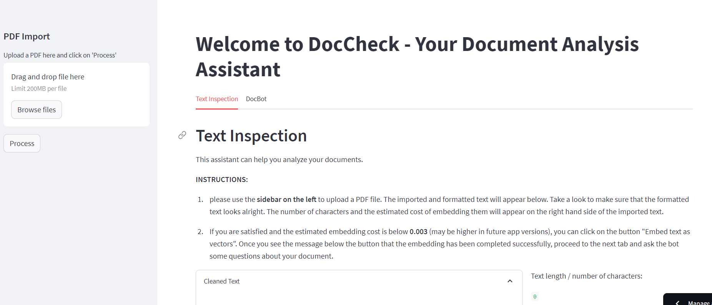

# LLM-facilitated AI Assistant for reviewing Accreditation Documentation
  

### Overview
This project uses Streamlit, OpenAI APIs and Langchain to create an online app which allows the user to upload PDF files and ask a Chatbot questions about them.

__The app currently does the following:__
- PDF import and text preprocessing:
    - imports PDF files, cleans text (removes uneccessary spaces, new lines, etc) and displays text in the User Interface (UI) for inspection
    - converts text into overlapping text chunks with a length of 1000 characters each
    - calculates the estimated embedding cost using tiktoken, and displays this in the UI
- Text embedding:
    - if the estimated cost is below the predetermined threshold, the user can click a button to embed the text chunks as vectors using OpenAIEmbeddings, and save them to a FAISS vector store
- Document Chatbot:
    - the user can use the DocBot tab in the user interface to submit queries about the documents
    - the queries are used in a similarity search to retrieve the most relevant text excerpts from the vector store
    - the excerpts are then submitted, along with the user's query, to ChatGPT using the OpenAI API
    - the API response is shown to the user

[Check out the live app!!](https://acc-check.streamlit.app/)  
[Check out the dedicated code repo](https://github.com/athielenhaus/LLM-facilitated-AI-assistant-for-Document-Analysis/tree/acc_check_prelim)  

### Current Project Status:

An initial version of the app attempted to implement a full-fledged analysis tool, which submitted a catalog of questions about the document. However, the results were unsatisfactory, which is why for the moment it was decided to publish the simple version linked above (the corresponding code is in the acc_check_prelim branch of the repo).

### Toolkit

the tools currently used include:

* Langchain: a relatively new library (released in October 2022) which simplifies working with LLMs. From this library I am using:
    - PDF loaders (PDFPlumber)
    - Text splitters: for splitting documents into chunks which can be processed for embedding purposes
    - OpenAI Embeddings: fast embeddings API which charges a small amount per submitted token.
    - Vector Store integrations: for saving embeddings to memory or disk (FAISS, ChromaDB...)
    - Retrieval chains: for conducting similarity searches in vector stores and submitting retrieved documents along with a query to an LLM
* OpenAI APIs: for accessing the OpenAI LLMs
* tiktoken: for converting text to tokens in order to estimate costs prior to embedding.
* Streamlit: a library for creating a simple frontend user interface.
* Unittest: for testing functions and classes

Thanks for reading! In case of any comments or questions, please drop me a line at arne.thielenhaus@gmail.com or on [LinkedIn](https://www.linkedin.com/in/arne-thielenhaus/).

